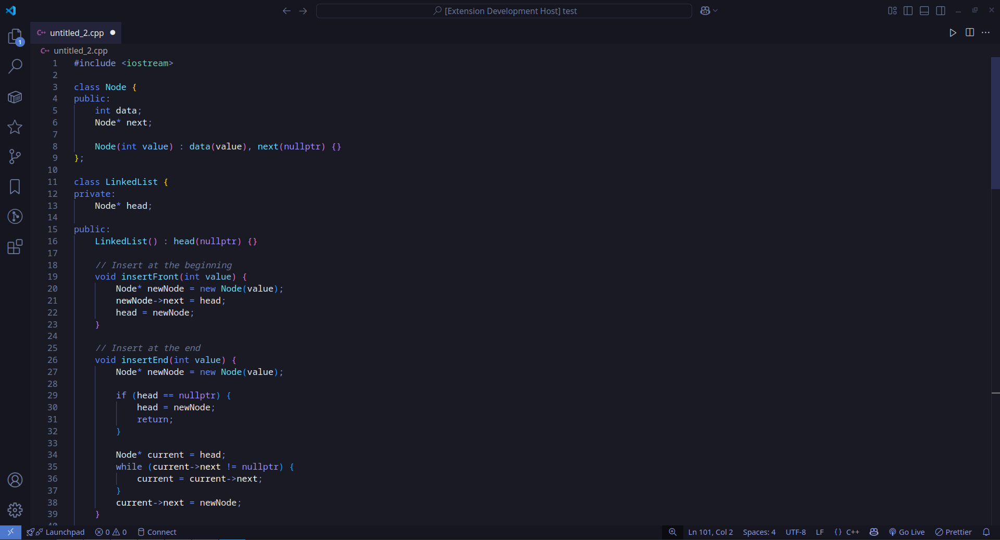

# Zein Theme

<div align="center">
    
</div>

A beautiful dark theme for VS Code with soothing blue and purple tones inspired by the Zein logo. Designed for coding comfort and reduced eye strain during long coding sessions.


## Screenshots



## Installation

1. Open **Extensions** sidebar panel in VS Code. `View → Extensions`
2. Search for `Zein Theme`
3. Click **Install** to install it
4. Click **Reload** to reload your editor
5. Select the theme: `Code/File → Preferences → Color Theme → Zein (dark)`

## Recommended Settings

For the best experience with Zein theme, we recommend using the following settings:

```json
{
    "editor.fontFamily": "Fira Code, monospace",
    "editor.fontSize": 14,
    "editor.lineHeight": 1.5,
    "editor.fontLigatures": true
}
```

### Recommended Fonts

The Zein theme looks great with these programmer fonts:

- [Fira Code](https://github.com/tonsky/FiraCode) (free, supports ligatures)
- [JetBrains Mono](https://www.jetbrains.com/lp/mono/) (free, supports ligatures)
- [Cascadia Code](https://github.com/microsoft/cascadia-code) (free, supports ligatures)
- [Source Code Pro](https://github.com/adobe-fonts/source-code-pro) (free)

## Feedback

If you encounter any issues or have suggestions for improvements, please open an issue on our [GitHub repository](https://github.com/khar34/zein-theme).

**Enjoy!**
